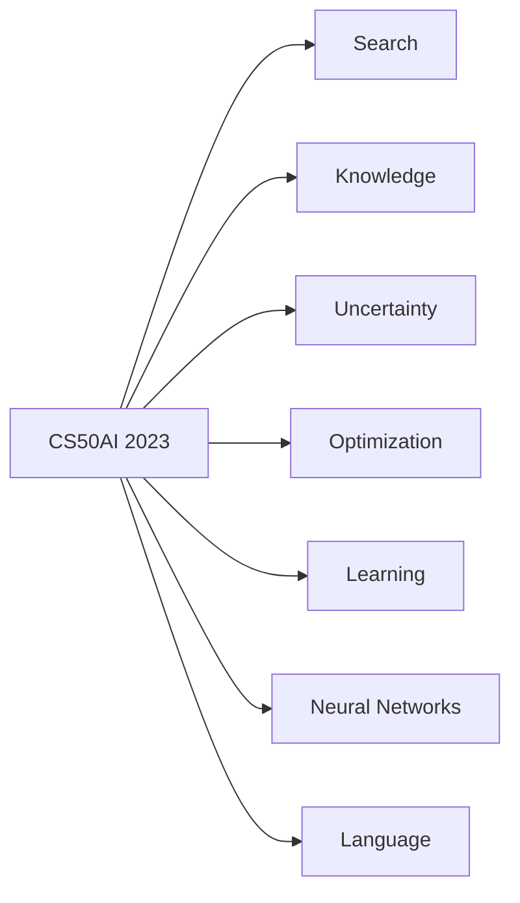
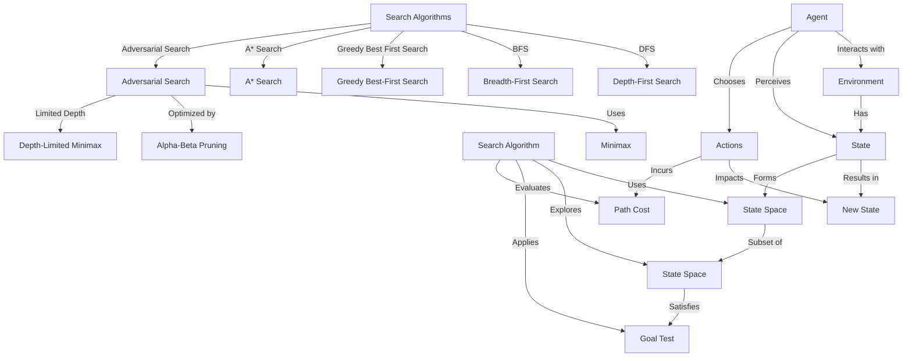
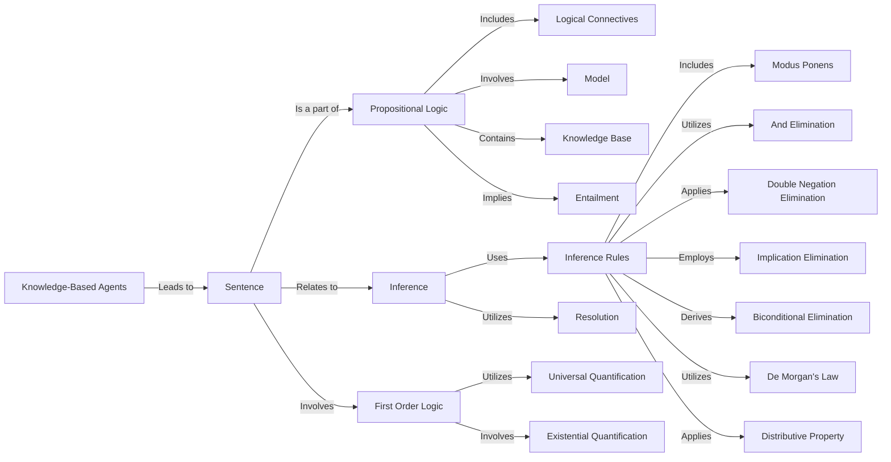

# 🧩HavardX: CS50's Introduction to Artificial Intelligence With Python

## The day enrolled this course: 

## Overview:

### Course 's content:

___

## Search

___

## Knowledge

___

## Uncertainty

___

## Optimization

___

## Learning

___

## Neural Networks

___

## Language

___

## Some evidence to demonstrate that I have completed this course from MOOCs :

### Progress

