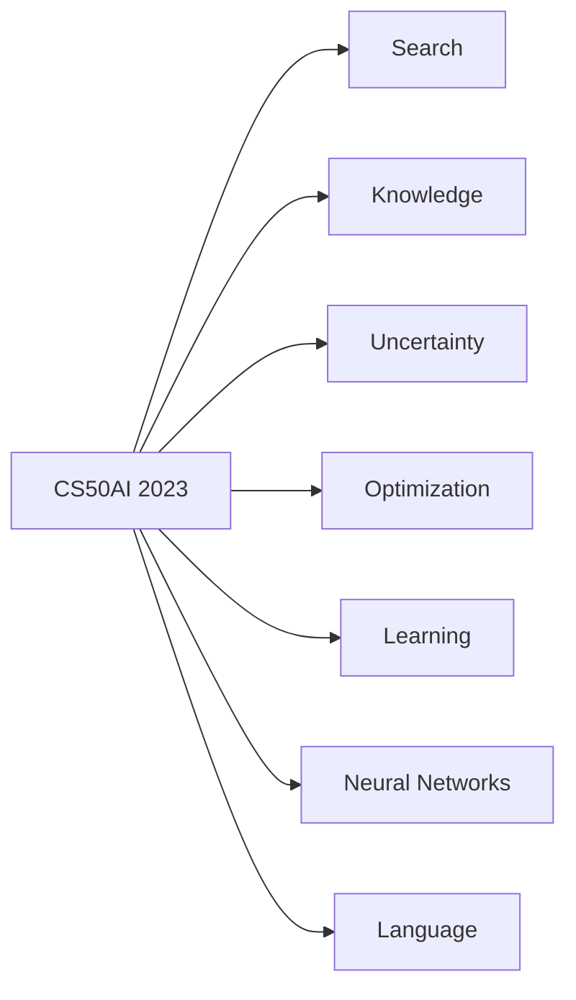

# 🧩HavardX: CS50's Introduction to Artificial Intelligence With Python

## The day enrolled this course: 

## Overview:

___

## Search
- Agent: entity that perceives its environment and acts upon that environment
  
- State: 

- State Space:

___

## Knowledge

___

## Uncertainty

___

## Optimization

___

## Learning

___

## Neural Networks

___

## Language

___
