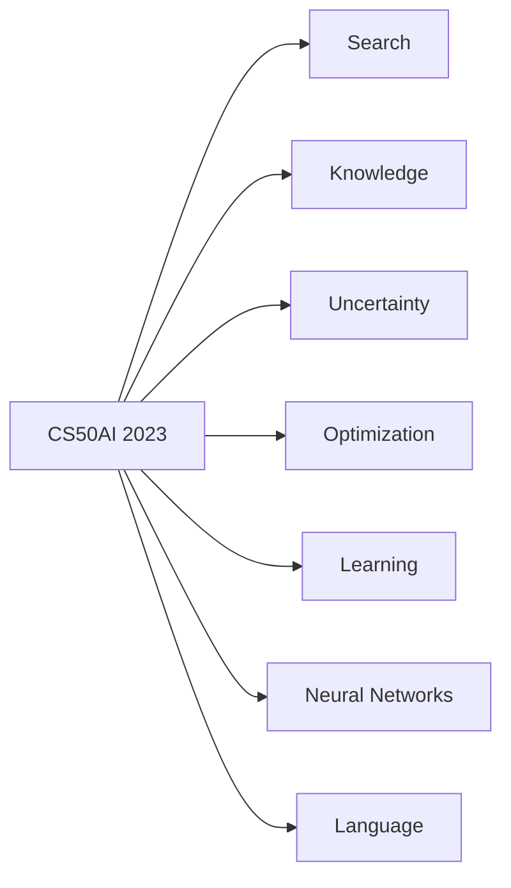
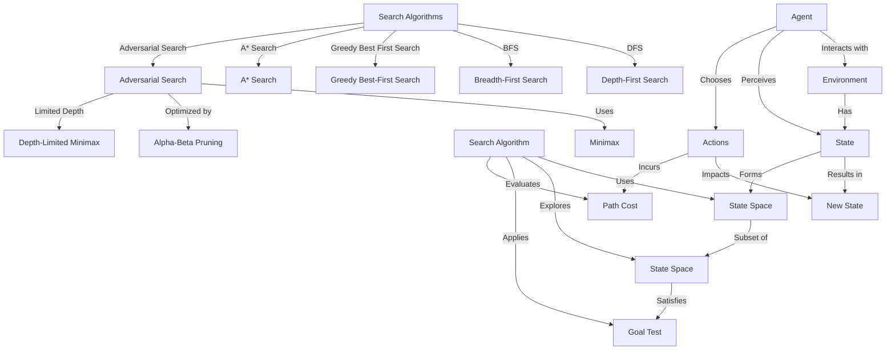
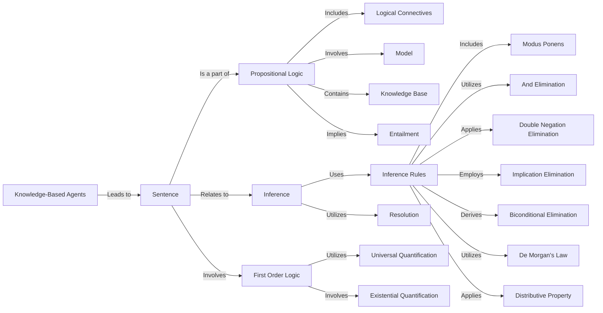
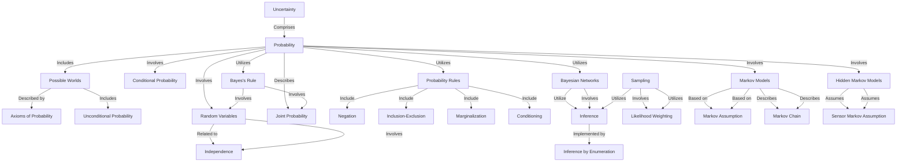
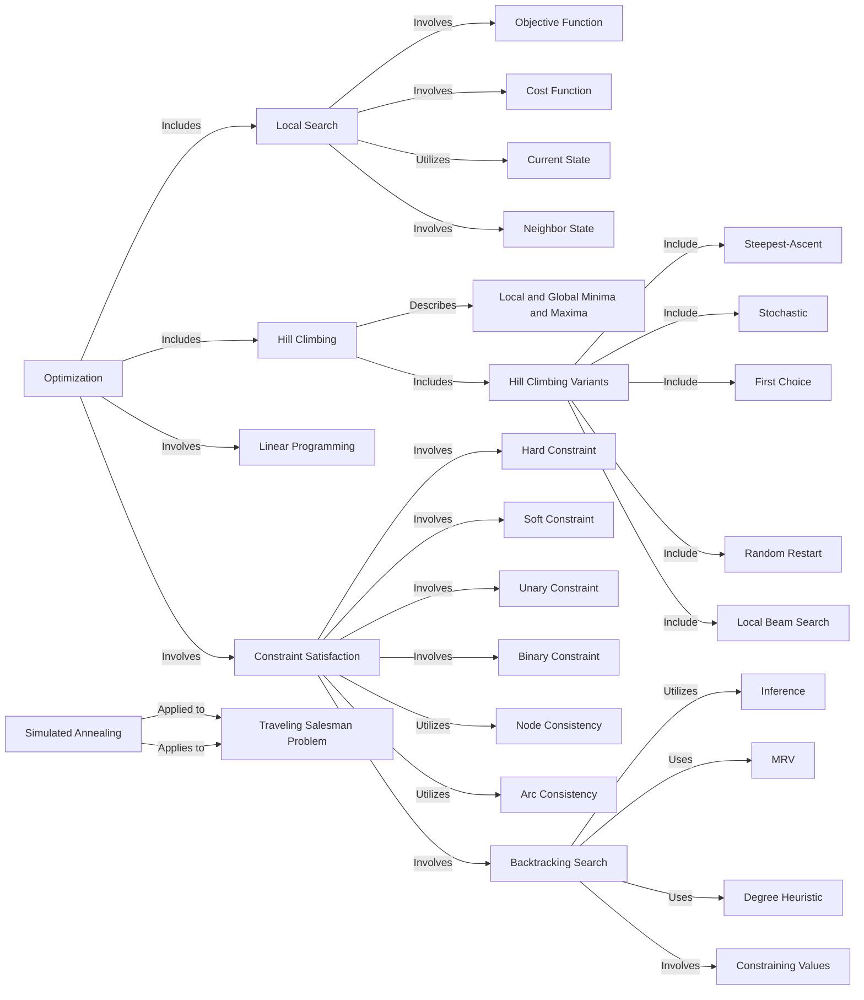
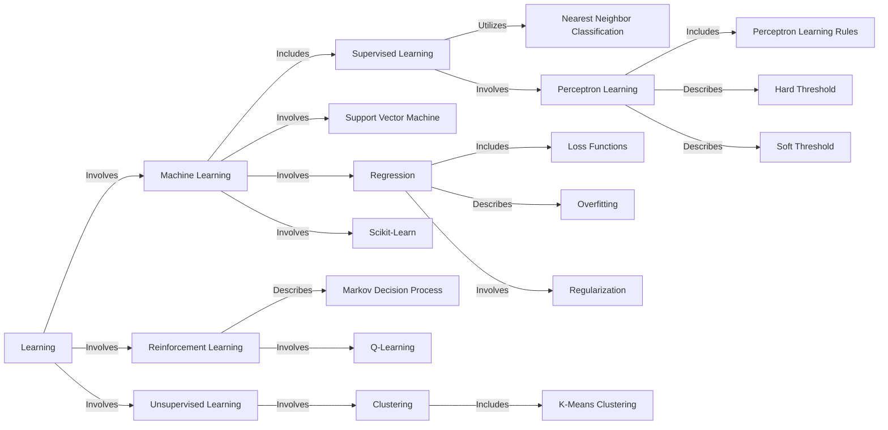
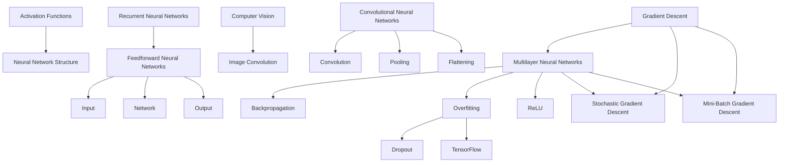
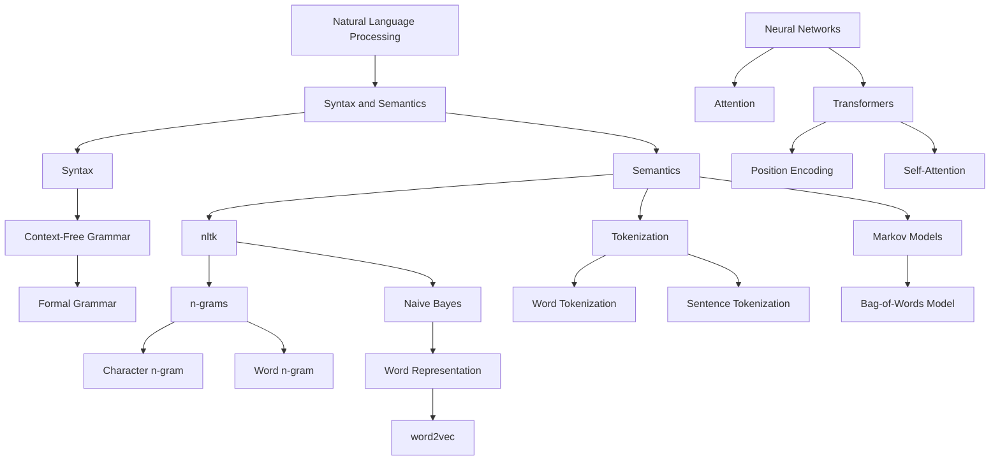

# 🧩HavardX: CS50's Introduction to Artificial Intelligence With Python

## Overview:

### Course 's content:

___

## Search

- `Agent` represents an entity interacting with the environment.
- `Environment` is the space in which the agent interacts and induces changes.
- `State` is the current condition of the environment.
- `Actions` are the steps or behaviors that the agent can perform.
- `State Space` is the collection of all possible states.
- `Goal Test` is the criterion to check if a state achieves the objective.
- `Path Cost` is the cost associated with a sequence of actions.
- `Search Algorithm` refers to the algorithm used to explore the state space.

___

## Knowledge

___

## Uncertainty

___

## Optimization

- Local Search:
  * Objective Function: A function describing the "quality" of a solution.
  * Cost Function: An expression evaluating the cost of a solution.
  * Current State: The current state of the system.
  * Neighbor State: States adjacent to the current state.

- Hill Climbing:
  * Local and Global Minima and Maxima: Local and global optimal points.
  * Hill Climbing Variants:
    + Steepest-Ascent
    + Stochastic
    + First Choice
    + Random Restart
    + Local Beam Search

- Simulated Annealing:
  * Traveling Salesman Problem: An optimization problem where a salesperson needs to find the shortest route through multiple cities.

- Linear Programming:
  * A optimization method using a linear objective function and linear constraints.

- Constraint Satisfaction:
  * Hard Constraint: A constraint that cannot be violated.
  * Soft Constraint: A constraint that can be violated with a cost.
  * Unary Constraint: A constraint on a single variable.
  * Binary Constraint: A constraint between two variables.

- Node Consistency:
A method to ensure that each variable satisfies all its constraints.

- Arc Consistency:
A method to ensure that every value assigned to each variable satisfies all constraints with other variables.

- Backtracking Search:
  * Inference: Using information from assigned variables to reduce search space.
  * MRV (Minimum Remaining Values): Choosing a variable with the fewest remaining values.
  * Degree Heuristic: Choosing a variable related to the most constraints.
  * Constraining Values: Prioritizing values with the fewest choices.
___

## Learning

- Machine Learning:
A field of study in artificial intelligence where systems learn from data.

- Supervised Learning:
A machine learning method where a model is trained on a labeled dataset.

- Nearest Neighbor Classification:
A classification method based on labeling data points based on their nearest neighbors.

- Perceptron Learning:
  * Perceptron Learning Rules: Rules for updating weights in a perceptron.
  * Hard Threshold: A threshold used to determine the perceptron's output.
  * Soft Threshold: A variation of a soft threshold in a perception.

- Support Vector Machine:
A machine learning model using a separating line with maximum margin between classes.

- Regression:
A method for predicting continuous values.
  * Loss Functions: Functions measuring the difference between prediction and actual values.
  * Overfitting: The phenomenon of a model overly emphasizing noise in training data.
  * Regularization: Techniques to reduce overfitting, including holdout cross-validation, training set, test set, and k-hold cross-validation.

- Scikit-Learn:
An open-source library for machine learning in Python.

- Reinforcement Learning:
A type of machine learning where a system interacts with an environment and learns from experience.

- Markov Decision Process:
A decision model based on the Markov process.

- Q-Learning:
A reinforcement learning algorithm using a strategy of greedy decision making, exploration, and exploitation.

- Unsupervised Learning:
A machine learning method that does not require labeled training data.

- Clustering:
A method automatically classifying data points into groups.

- K-Means Clustering:
A popular clustering method assuming a certain number, k, of groups.

___

## Neural Networks

___

## Language

___

